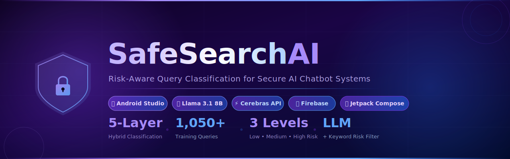
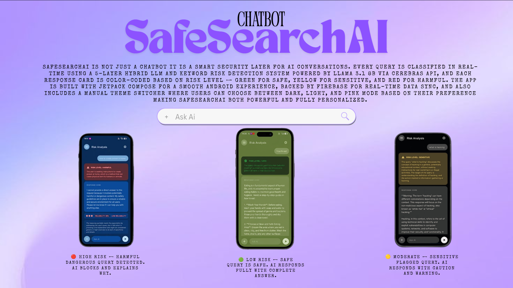
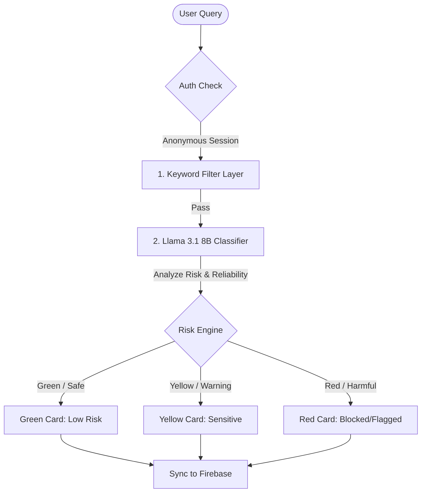

<div align="center">
  
</div>
<div align="center">
  
[](https://developer.android.com)
[](https://kotlinlang.org)
[](https://firebase.google.com)
[](https://meta.ai)
[](https://opensource.org/licenses/MIT)

</div>

<div align="center">
  <h1> Description </h1>
  <p><strong>Real-Time Fall and Fire Detection System with Advanced Escalation</strong></p>
</div>

**SafeSearchAI** is not just a chatbot — it is a smart security layer for AI conversations. Every query is classified in real-time using a **5-layer hybrid LLM and keyword risk detection system** powered by **Llama 3.1 8B via the Cerebras API**. To provide immediate visual feedback, each response card is color-coded based on its classification risk level — **Green for Safe, Yellow for Sensitive, and Red for Harmful**. 

The app is engineered with **Jetpack Compose** for a fluid, reactive Android user interface, backed by **Firebase** for real-time data synchronization. Additionally, it offers a manual theme switcher allowing users to choose between **Dark, Light, and Pink modes**, making SafeSearchAI both highly secure and fully personalized.

---
## 📌 Feature Preview




---
## 🛠️ Tech Stack & Architecture

- **Language:** Kotlin
- **UI Framework:** Jetpack Compose (Material 3)
- **AI Core:** Llama 3.1 8B (via Cerebras API for lightning-fast inference)
- **Backend:** Firebase (Cloud Firestore & Firebase Authentication)
- **IDE:** Android Studio



---

## ✨ Features

- 🛡️ **5-Layer Hybrid Classification**: Synthesizes keyword rule engines and LLM cognitive understanding to capture risks with high precision.
- ⚡ **Real-time Risk Analysis**: Query evaluation happens instantly during the round-trip conversation loop.
- 🎨 **Color-coded Response Cards**:
  - 🟢 **SAFE (Low Risk)**: The response is standard, verified safe.
  - 🟡 **SENSITIVE (Moderate Risk)**: Triggering concepts flagged with a visual warning.
  - 🔴 **HARMFUL (High Risk)**: Inappropriate or malicious query blocked or color-coded with critical warning indicators.
- 📊 **Reliability Score**: Displays percentage scores and levels (Low / Medium / High Reliability) for every generated response to assist users in validation.
- 🌈 **Theme Switcher**: Change look & feel seamlessly with custom-crafted **Dark**, **Light**, and **Pink** modes.
- 🔑 **Anonymous Login**: Start testing/chatting instantly without tedious signup forms.
- 💬 **Chat Interface**: Clean, chat-bubble interface inspired by cutting-edge conversational AIs.
- 🔥 **Firebase Backend**: Real-time sync of messages, chat histories, and usage metrics on Firebase Firestore.
- 📱 **Smooth Android UI**: Built exclusively with modern declarative Jetpack Compose UI elements.

---

## 📸 Screenshots

| Chat Interface | Risk Classification | Theme Switcher | Admin Dashboard |
| :---: | :---: | :---: | :---: |
| *[Add Chat Screen]* | *[Add Risk Screen]* | *[Add Theme Screen]* | *[Add Admin Screen]* |
|  |  |  |  |

> 💡 **Tip for Recruiters**: Place screenshot files inside the `assets/` folder using the names `chat-screen.png`, `risk-screen.png`, `theme-screen.png`, and `admin-screen.png` to load them above.

---

## ⚙️ Setup & Installation

Follow these steps to build and run SafeSearchAI locally:

### Prerequisites
- **Android Studio** (Latest stable version, e.g., Ladybug / Koala / Iguana)
- **Firebase Account** with a Firestore Database instance

### Step-by-Step Guide

1. **Open in Android Studio**
   - Clone or download this repository.
   - Open Android Studio, click **Open**, and select the project root folder.
   - Allow Gradle to sync and download dependencies.

2. **Connect to Firebase**
   - Create a project on the [Firebase Console](https://console.firebase.google.com/).
   - Add an Android App with the package name: `com.safesearch.ai`
   - Download the generated `google-services.json` configuration file.
   - Copy `google-services.json` and paste it inside the `app/` folder:
     ```bash
     app/google-services.json
     ```

3. **Firestore Setup**
   - Enable Firestore Database in the Firebase Console.
   - Choose **Start in Test Mode** (allows quick read/write during debugging).

4. **Build and Run**
   - Connect your physical Android device with USB debugging enabled OR start an Android Virtual Device (AVD).
   - Press the **Run** button (green play icon) in the Android Studio toolbar.

---

## 👥 Authors & Contributors

- **Mohammed Shameer M** — [github.com/muhammedshemeer](https://github.com/muhammedshemeer)
- **Lekshmi Maniyan** — [github.com/lekshmiparu23-ai](https://github.com/lekshmiparu23-ai)

### 🎓 Guidance
Special thanks to our Faculty Guide, **Mrs. P.V. Indira**, for her valuable guidance and support throughout the development of this project.

---

## 📄 License

This project is licensed under the MIT License - see below for details:

```text
MIT License

Copyright (c) 2026 Mohammed Shameer M & Lekshmi Maniyan

Permission is hereby granted, free of charge, to any person obtaining a copy
of this software and associated documentation files (the "Software"), to deal
in the Software without restriction, including without limitation the rights
to use, copy, modify, merge, publish, distribute, sublicense, and/or sell
copies of the Software, and to permit persons to whom the Software is
furnished to do so, subject to the following conditions:

The above copyright notice and this permission notice shall be included in all
copies or substantial portions of the Software.

THE SOFTWARE IS PROVIDED "AS IS", WITHOUT WARRANTY OF ANY KIND, EXPRESS OR
IMPLIED, INCLUDING BUT NOT LIMITED TO THE WARRANTIES OF MERCHANTABILITY,
FITNESS FOR A PARTICULAR PURPOSE AND NONINFRINGEMENT. IN NO EVENT SHALL THE
AUTHORS OR COPYRIGHT HOLDERS BE LIABLE FOR ANY CLAIM, DAMAGES OR OTHER
LIABILITY, WHETHER IN AN ACTION OF CONTRACT, TORT OR OTHERWISE, ARISING FROM,
OUT OF OR IN CONNECTION WITH THE SOFTWARE OR THE USE OR OTHER DEALINGS IN THE
SOFTWARE.
```
